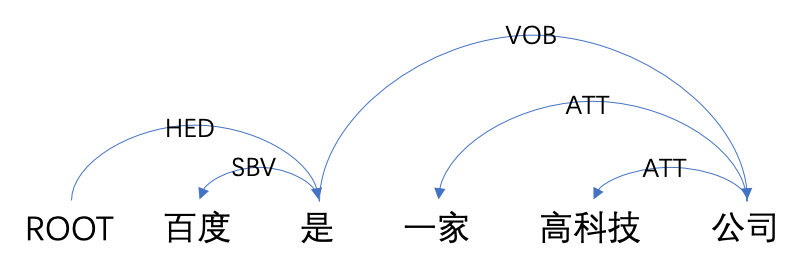

# DDParser
 - 应用工具
   - [基于依存分析树和GAT的句子表示工具](./tools/representation)
 - DDParser
   - [依存句法分析简介](#依存句法分析简介)
   - [项目介绍](#项目介绍)
   - [快速开始](#快速开始)
   - [进阶使用](#进阶使用)
   - [数据集介绍](#数据集介绍)
   - [文件结构](#文件结构)
   - [后期计划](#后期计划)
   - [参考资料](#参考资料)
   - [文献引用](#文献引用)
   - [如何贡献](#如何贡献)

[](https://pypi.org/project/ddparser/)
[](./LICENSE)


## 依存句法分析简介

依存句法分析是自然语言处理核心技术之一，旨在通过分析句子中词语之间的依存关系来确定句子的句法结构，如下图实例所示：
<br>
依存句法分析作为底层技术，可直接用于提升其他NLP任务的效果，这些任务包括但不限于语义角色标注、语义匹配、事件抽取等。该技术具有很高的研究价值及应用价值。为了方便研究人员和商业合作伙伴共享效果领先的依存句法分析技术，我们开源了基于大规模标注数据训练的高性能的依存句法分析工具，并提供一键式安装及预测服务，用户只需一条命令即可获取依存句法分析结果。

## 项目介绍
DDParser(Bai**d**u **D**ependency **Parser**)是百度自然语言处理部基于深度学习平台飞桨([PaddlePaddle](https://www.paddlepaddle.org.cn/))和大规模标注数据研发的依存句法分析工具。其训练数据不仅覆盖了多种输入形式的数据，如键盘输入query、语音输入query，还覆盖了多种场景的数据，如新闻、论坛。该工具在随机评测数据上取得了优异的效果。同时，该工具使用简单，一键完成安装及预测。

### 效果说明
| 数据集   | UAS    | LAS    |
| :------- | :----- | :----- |
| CTB5     | 90.31% | 89.06% |
| DuCTB1.0 | 94.80% | 92.88% |

- **CTB5**: [Chinese Treebank 5.0](https://catalog.ldc.upenn.edu/LDC2005T01) 是Linguistic Data Consortium (LDC)在2005年发布的中文句法树库，包含18,782条句子，语料主要来自新闻和杂志，如新华社日报。
- **DuCTB1.0**: `Baidu Chinese Treebank1.0`是百度构建的中文句法树库，即本次所发布的依存句法分析工具-DDParser的训练数据来源，具体信息参见[数据来源](#数据来源)
  
<font size=3 color=gray>注：由于CTB5数据集规模较小，最优模型（即评测模型）使用了句子的word级表示、POS(词性标签)表示、以及预训练词向量，而DuCTB1.0数据集规模较大，其最优模型仅使用了句子的word级和char级表示。</font>


## 快速开始

### 版本依赖
* `python`: >=3.6.0, <3.8.0
* [`paddlepaddle`](https://www.paddlepaddle.org.cn/): >=1.8.2, <2.0
* [`LAC`](https://github.com/baidu/lac): >=0.1.4
<br>

### 一键安装
用户可以使用以下方式进行一键安装及预测：
- pip安装 pip install ddparser                         
- 半自动安装 先从 https://pypi.org/project/ddparser/ 下载包，解压后使用`python setup.py install`安装包。

### 功能使用
#### 未分词方式
* 代码示例
```python
>>> from ddparser import DDParser
>>> ddp = DDParser()
>>> # 单条句子
>>> ddp.parse("百度是一家高科技公司")
[{'word': ['百度', '是', '一家', '高科技', '公司'], 'head': [2, 0, 5, 5, 2], 'deprel': ['SBV', 'HED', 'ATT', 'ATT', 'VOB']}]
>>> # 多条句子
>>> ddp.parse(["百度是一家高科技公司", "他送了一本书"])
[{'word': ['百度', '是', '一家', '高科技', '公司'], 'head': [2, 0, 5, 5, 2], 'deprel': ['SBV', 'HED', 'ATT', 'ATT', 'VOB']}, 
{'word': ['他', '送', '了', '一本', '书'], 'head': [2, 0, 2, 5, 2], 'deprel': ['SBV', 'HED', 'MT', 'ATT', 'VOB']}]
>>> # 输出概率和词性标签
>>> ddp = DDParser(prob=True, use_pos=True)
>>> ddp.parse(["百度是一家高科技公司"])
[{'word': ['百度', '是', '一家', '高科技', '公司'], 'postag': ['ORG', 'v', 'm', 'n', 'n'], 'head': [2, 0, 5, 5, 2], 'deprel': ['SBV', 'HED', 'ATT', 'ATT', 'VOB'], 'prob': [1.0, 1.0, 1.0, 1.0, 1.0]}]
>>> # buckets=True, 数据集长度不均时处理速度更快
>>> ddp = DDParser(buckets=True)
>>> # 选择使用transformer模型
>>> ddp = DDParser(encoding_model='transformer')
>>> # 使用GPU
>>> ddp = DDParser(use_cuda=True)
```

#### 已分词方式
* 代码示例
```python
>>> from ddparser import DDParser
>>> ddp = DDParser()
>>> ddp.parse_seg([['百度', '是', '一家', '高科技', '公司'], ['他', '送', '了', '一本', '书']])
[{'word': ['百度', '是', '一家', '高科技', '公司'], 'head': [2, 0, 5, 5, 2], 'deprel': ['SBV', 'HED', 'ATT', 'ATT', 'VOB']}, 
{'word': ['他', '送', '了', '一本', '书'], 'head': [2, 0, 2, 5, 2], 'deprel': ['SBV', 'HED', 'MT', 'ATT', 'VOB']}]
>>> # 输出概率
>>> ddp = DDParser(prob=True)
>>> ddp.parse_seg([['百度', '是', '一家', '高科技', '公司']])
[{'word': ['百度', '是', '一家', '高科技', '公司'], 'head': [2, 0, 5, 5, 2], 'deprel': ['SBV', 'HED', 'ATT', 'ATT', 'VOB'], 'prob': [1.0, 1.0, 1.0, 1.0, 1.0]}]
```
<font size=3 color=gray>注：标签含义见[依存句法分析标注关系集合](#依存句法分析标注关系集合)。</font>
## 进阶使用
### 项目下载

用户可以通过`git clone https://github.com/baidu/DDParser`下载源码，并且执行下列命令安装依赖库：
```shell
pip install --upgrade paddlepaddle-gpu
pip install --upgrade LAC
```

### 模型下载
我们发布了基于`DuCTB1.0`训练的模型，通过执行`cd ddparser && sh download_pretrained_model.sh`下载模型，模型将保存在./ddparser/model_files/baidu下。

### 训练
用户可以通过`sh run_train.sh`训练模型。详细命令如下所示：

```
CUDA_VISIBLE_DEVICES=0 python -u run.py \
        --mode=train \
        --use_cuda \
        --feat=char \
        --preprocess \
        --model_files=model_files/baidu \
        --model_files=model_files/baidu \
        --train_data_path=data/baidu/train.txt \
        --valid_data_path=data/baidu/dev.txt \
        --test_data_path=data/baidu/test.txt \
        --unk=UNK \
        --buckets=15
```
<font size=3 color=gray>注：用户可通过修改`train_data_path`, `valid_data_path`和`test_data_path`指定训练集，评估集和测试集, 参数含义见[参数说明](#参数说明)，所用数据集格式见[数据格式说明](#数据格式说明)。</font>

### 评估
用户可以通过执行`sh download_data.sh`下载我们提供的评估集，其将保存在./data/baidu/下。该评估集共2,592条句子，平均长度为11.27字符。<br>
用户可以通过执行`sh run_evaluate.sh`评估模型效果，详细命令如下所示：
```shell
CUDA_VISIBLE_DEVICES=0 python run.py \
                                --mode=evaluate \
                                --use_cuda \
                                --model_files=model_files/baidu \
                                --test_data_path=data/baidu/test.txt \
                                --buckets=15 \
                                --tree
```
<font size=3 color=gray>注：用户可通过修改`test_data_path`指定评估集,所用数据集格式见[数据格式说明](#数据格式说明)。</font>

### 预测
基于源码，我们提供两种基于命令行的预测方法，分别用于已分词数据和未分词数据。

**基于已分词数据的预测**<br>

预测的输入数据要求以[`CoNLL-X`](#数据格式说明)([官方说明](https://ilk.uvt.nl/~emarsi/download/pubs/14964.pdf))格式组织，缺失字段使用“-”代替。通过执行`sh run_predict.sh`进行预测，详细命令如下所示：
```shell
CUDA_VISIBLE_DEVICES=0 python run.py \
                                --mode=predict \
                                --use_cuda \
                                --model_files=model_files/baidu \
                                --infer_data_path=data/baidu/test.txt \
                                --infer_result_path=data/baidu/test.predict \
                                --buckets=15 \
                                --tree 
```
<font size=3 color=gray>注：用户可通过修改`infer_data_path`和`infer_result_path`指定要预测的数据集和预测结果的路径。</font>

**基于未分词数据的预测**<br>
预测的输入数据为字符串形式，一行一条数据。通过执行`sh run_predict_query.sh`对来自标准输入的数据进行预测，详细命令如下所示：
```shell
CUDA_VISIBLE_DEVICES=0 python run.py \
                                --mode=predict_q \
                                --use_cuda \
                                --model_files=model_files/baidu \
                                --buckets=15 \
                                --tree
```
<font size=3 color=gray>注：默认调用[`LAC`](https://github.com/baidu/lac)预测分词和词性<br></font>

### 参数说明
```
mode: 任务模式（train, evaluate, predict, predict_q）
config_path：保存超参文件的路径
model_files：保存模型的路径
train_data_path：训练集文件的路径
valid_data_path：验证集文件的路径
test_data_path：测试集文件的路径
infer_data_path：待预测文件的路径
pretrained_embedding_dir：预训练词向量的路径
batch_size：批尺寸
log_path：日志的路径
log_level: 日志等级，默认INFO（'DEBUG', 'INFO', 'WARNING', 'ERROR', 'FATAL'）
infer_result_path：预测结果保存的路径
use_cuda：如果设置，则使用GPU
preprocess：训练模式下的使用参数，设置表示会基于训练数据进行词统计等操作，不设置默认使用已统计好的信息（节省统计时间）；针对同一训练数据，多次训练可不设置该参数。
seed：随机数种子（默认：1）
threads：控制每个paddle实例的线程数
tree：确保输出结果是正确的依存句法树
prob：如果设置，则输出每个弧的概率，保存在结果的PROB列。
feat：选择输入的特征（char，pos）
buckets：选择最大分桶数（默认：15）
punct：评估结果的时候是否包含标点
unk：指定在预训练词表中UNK符号
encoding_model：选择底层模型, 默认lstm(lstm, transformer)
```
### 数据格式说明
本项目数据格式基于CoNLL-X([官方说明](https://ilk.uvt.nl/~emarsi/download/pubs/14964.pdf))的风格，缺少的字段使用"-"代替（用户只用关注ID，FROM，HEAD，DEPREL，PROB等列即可），如“百度是一家高科技公司”的可解析为如下格式：
```
ID      FROM   LEMMA CPOSTAG POSTAG  FEATS   HEAD    DEPREL   PROB   PDEPREL
1       百度    百度    -       -       -       2       SBV     1.0     -
2       是      是      -       -       -       0       HED     1.0     -
3       一家    一家    -       -       -       5       ATT     1.0     -
4       高科技  高科技  -       -       -       5       ATT     1.0     -
5       公司    公司    -       -       -       2       VOB     1.0     -
```

## 数据集介绍
### 依存句法分析标注关系集合
DuCTB1.0数据集含14种标注关系，具体含义见下表：

| Label |  关系类型  | 说明                     | 示例                           |
| :---: | :--------: | :----------------------- | :----------------------------- |
|  SBV  |  主谓关系  | 主语与谓词间的关系       | 他送了一本书(他<--送)          |
|  VOB  |  动宾关系  | 宾语与谓词间的关系       | 他送了一本书(送-->书)          |
|  POB  |  介宾关系  | 介词与宾语间的关系       | 我把书卖了（把-->书）          |
|  ADV  |  状中关系  | 状语与中心词间的关系     | 我昨天买书了（昨天<--买）      |
|  CMP  |  动补关系  | 补语与中心词间的关系     | 我都吃完了（吃-->完）          |
|  ATT  |  定中关系  | 定语与中心词间的关系     | 他送了一本书(一本<--书)        |
|   F   |  方位关系  | 方位词与中心词的关系     | 在公园里玩耍(公园-->里)        |
|  COO  |  并列关系  | 同类型词语间关系         | 叔叔阿姨(叔叔-->阿姨)          |
|  DBL  |  兼语结构  | 主谓短语做宾语的结构     | 他请我吃饭(请-->我，请-->吃饭) |
|  DOB  | 双宾语结构 | 谓语后出现两个宾语       | 他送我一本书(送-->我，送-->书) |
|  VV   |  连谓结构  | 同主语的多个谓词间关系   | 他外出吃饭(外出-->吃饭)        |
|  IC   |  子句结构  | 两个结构独立或关联的单句 | 你好，书店怎么走？(你好<--走)  |
|  MT   |  虚词成分  | 虚词与中心词间的关系     | 他送了一本书(送-->了)          |
|  HED  |  核心关系  | 指整个句子的核心         |                                |

### 数据来源
DuCTB1.0：`Baidu Chinese Treebank 1.0`是百度构建的中文依存句法树库，包含近100万句子（本次发布模型的训练数据近53万句）。语料来自搜索query、网页句子，覆盖了手写、语音等多种输入形式，同时覆盖了新闻、论坛等多种场景。

## 文件结构
```text
.
├── LICENSE
├── README.md
├── requirements.txt   #依赖模块及版本要求
├── ddparser           #DDParser的核心代码，包含模型，测试数据，运行脚本等
```

## 后期计划
-  提升预测速度
-  蒸馏模型，减小模型体积
-  发布句法分析使用工具，包含但不限于事件抽取、片段识别、句子表示等工具


## 参考资料
本项目所用方法出自论文[《Deep Biaffine Attention for Neural Dependency Parsing》](https://arxiv.org/abs/1611.01734)，对应的pytorch版本参见[yzhangcs/parser](https://github.com/yzhangcs/parser)。

## 文献引用
如果您的学术工作成果中使用了DDParser，请您增加下述引用。我们非常欣慰DDParser能够对您的学术工作带来帮助。
```text
@misc{zhang2020practical,
    title={A Practical Chinese Dependency Parser Based on A Large-scale Dataset},
    author={Shuai Zhang and Lijie Wang and Ke Sun and Xinyan Xiao},
    year={2020},
    eprint={2009.00901},
    archivePrefix={arXiv},
    primaryClass={cs.CL}
}
```

## 如何贡献
我们欢迎开发者向DDParser贡献代码。如果您开发了新功能或发现了bug，欢迎给我们提交PR。
